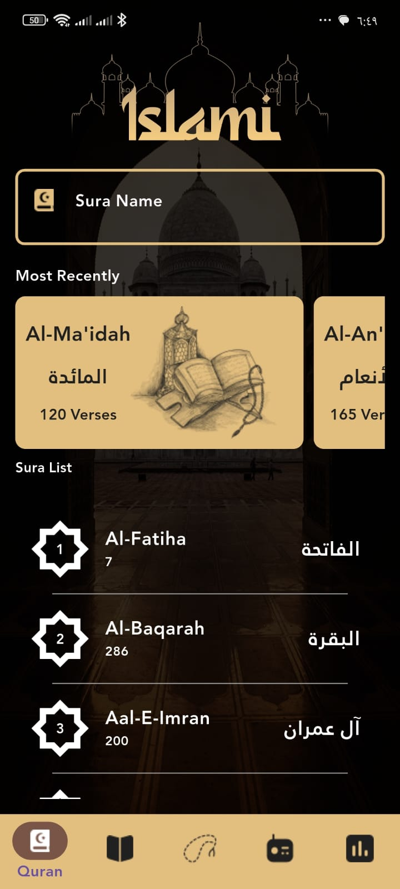

# 🕌 Islami App (Flutter)

Islami is a Flutter mobile application that helps Muslims with daily worship by providing Azkar, Sebha, and other essential Islamic features in a clean and simple UI.

---

## ✨ Features
- 📿 Sebha (Tasbeeh) with counter
- 📖 Daily Azkar (Morning, Evening, Sleeping, etc.)
- 🌙 Simple & clean UI
- 🌗 Light & Dark Mode support
- 📱 Responsive design

---

## 🖼️ Screenshots

<p float="left">
  
  
  
  
  

</p>

---

## 🛠️ Built With
- Flutter
- Dart
- Material Design

---

## 🚀 Getting Started

### Prerequisites
- Flutter SDK
- Dart SDK

### Run the app
```bash
flutter pub get
flutter run
